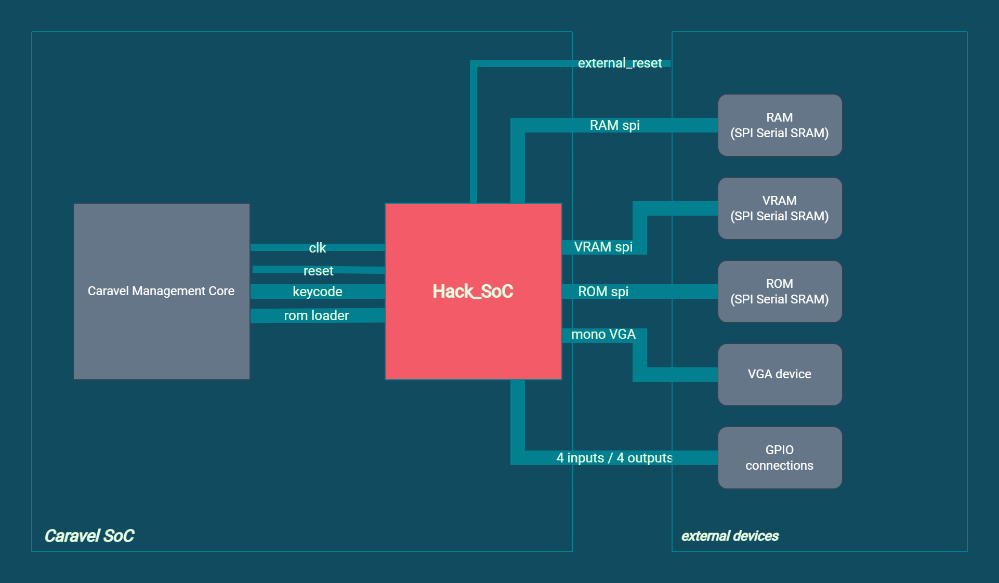
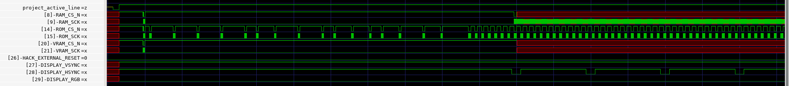
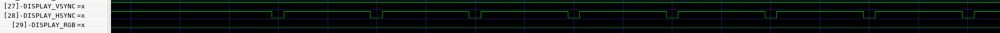
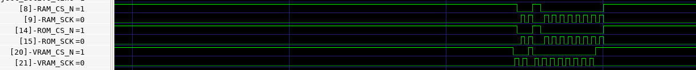
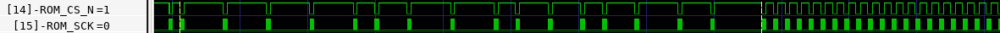
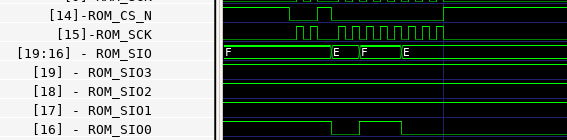
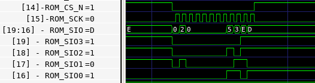
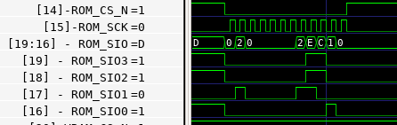
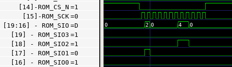

## **MPW3 silicon test: Wrapped Hack SoC project inside ZA multi project**

---
### **Architecture overview:**

### **MPRJ_IO Connections:**

| |  | |  |
|---|---|---|---|
|HACK_EXTERNAL_RESET|input|MPRJ_IO[26]|connect to GND|
|DISPLAY_RGB |output|MPRJ_IO[29]|connector to Logic Analyzer or Scope|
|DISPLAY_HSYNC |output|MPRJ_IO[28]|connector to Logic Analyzer or Scope|
|DISPLAY_VSYNC |output|MPRJ_IO[27]|connector to Logic Analyzer or Scope|
|ROM_CS_N |output|MPRJ_IO[14]|connector to Logic Analyzer or Scope|
|ROM_CSK |output|MPRJ_IO[15]|connector to Logic Analyzer or Scope|
|RAM_CS_N |output|MPRJ_IO[8]|connector to Logic Analyzer or Scope|
|RAM_CSK |output|MPRJ_IO[9]|connector to Logic Analyzer or Scope|

---
### **Simulation outputs:**

### Overview

 
 

### Display Lines (HSYNC, VSYNC, RGB)

After project becomes active the first expected values would be:

`vsync` starts with 1 and flips to 0 with a period of `system_clock_period * 420,000` (16.8ms with a 25MHz clock)

`hsync` starts with 1 and flips to 0 with a period of `system_clock_period * 800` (32us with a 25MHz clock)

`rgb` it should start with 0 and it would become uncertain after a while if no external memories are connected

 
 

### External SRAM SPI lines

After the project becomes active it configures the 23LC1024 memories (ram, rom, vram) sending this commands.
For reference, all the clock (`sck`) lines have a pulse twice the length of the system clock period 

After the initilization, and without connecting the external 23LC1024 chips, the only lines that we can analyze are the ROM ones:

In the image you can see 3 different states of communication with the rom chip:  
First pack of data is the 23LC1024 mode configuration, as shown in the previous image.  
After that there are 16 `rom_cs_n` assertions that are the 16 words of the hack program being sent to the rom.  
Once the rom is loaded the HACK processor starts running and starts reading the rom with a constant frequency.  
In this running state `rom_cs_n` line should have a period of `system_clock_period * 70` (2800ns with a 25MHz clock). That is the period of the HACK processor clock, in which the system should fetch a new instruction from ROM
In all those cases `rom_csk` should have a period of `system_clock_period * 2` when active

Here's a detail of how those reads and writes to the rom looks like:

 

---

### TESTING MORE PINS

There are some other `MPRJ_IO` lines that might be possible to test even without the 23LC1024 chips connected
| |  | |  |
|---|---|---|---|
|ROM_SIO3 |inout (but output for this test) |MPRJ_IO[19]|connector to Logic Analyzer or Scope|
|ROM_SIO2 |inout (but output for this test) |MPRJ_IO[18]|connector to Logic Analyzer or Scope|
|ROM_SIO1 |inout (but output for this test) |MPRJ_IO[17]|connector to Logic Analyzer or Scope|
|ROM_SIO0 |inout (but output for this test) |MPRJ_IO[16]|connector to Logic Analyzer or Scope|

These are the rom SPI/QSPI data lines

First pack of data sent to the rom: 23LC1024 initialization:  

Second pack of data sent to the rom: write 0x53ED:  

Third pack of data sent to the rom: write 0xEC10:  

Fourth pack of data sent to the rom: write 0x4000:  

---

### Notes

- Had to use mpw-3a PDK to simulate because mpw-3b was overriten at some point on my environment
- Created an empty 23LC1024 so there's no memory simulation, like in the test we are going to do with Matt
- Modified the original cocotb test bench to not check for memory values and just let the procesor run for some cycles

