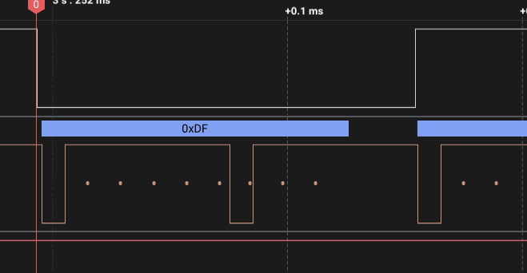
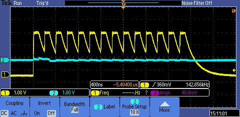
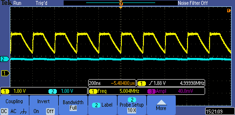
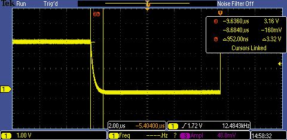

# NOTES from Matt document

### start with hsync & vsync

### chip 8

pin 28 hsync 10us, 70us up (period 80us)  
pin 27 vsync 42ms , 161us down  

nothing on 14 and 15 so far
pin 14 rom cs_n
pin 15 rom sck

### chip 7

hsync but not vsync  
nothing on rom lines  

### chip 2

hsync but not vsync  
nothing on 14 but (distorted) clk on 15  

### chip 4

hsync, no vsync  
nothing on 14 15  

### chip 5

pin 15 oscillating, 200ns  
nothing 14  

---

