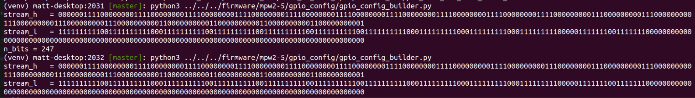
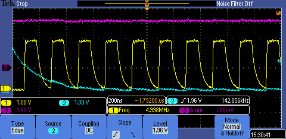

# NOTES from Matt document

trying first putting reset (pin 26) pulled low.

### chip 2

before - hsync but not vsync, nothing on 14 but (distorted) clk on 15  
now, we do get CS on pin 14.  
this was with the freq_counter gpio_io setup. (with hsync and vsync off)  

after turning on hsync and vsync pins, we lose the cs and clock (which are on the other side of the chain)

### setup reset
pin 26 is reset. high to reset. nothing changes (on pin 9, 14, 15, 27) when held high

Pin 9 (RAM_CSK) we have a constant clock aligned with the pin 15 (ROM_CSK) one

We got vsync on pin 27

pulldown resistor on rom clk
10k was too high (not enough pulldown)
1k results in this

### full io config
We then made the full IO configuration for the project (as we were still using some default configuration on many of the pins)  
With that we got:  
- pin 9: RAM_CSK signal
- pin 15: ROM_CSK signal
- pin 27: VSYNC signal
- pin 28: HSYNC signal
- pin 28: RGB signal
We didn't get any signal on ROM_CS_N, RAM_CS_N

